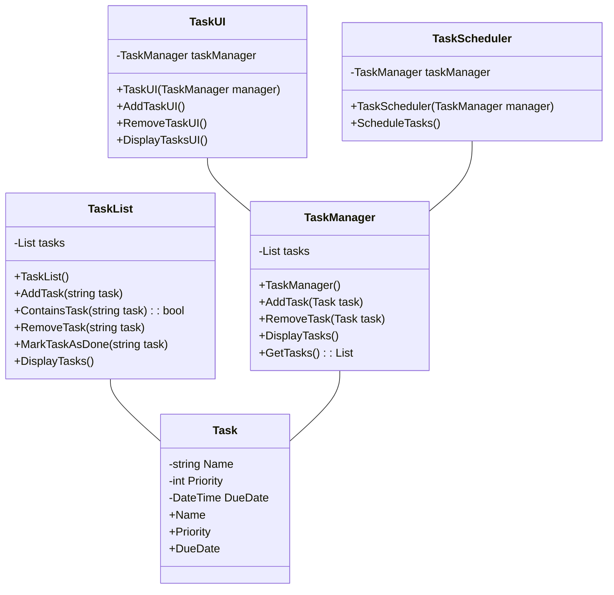

#ÄÎÁÀÂËÅÍÎ ÄËß ÂÒÎĞÎÉ ËÀÁÎĞÀÒÎĞÍÎÉ ĞÀÁÎÒÛ

```mermaid
classDiagram
    class TaskList {
        -List<string> tasks
        +TaskList()
        +AddTask(string task)
        +ContainsTask(string task) : bool
        +RemoveTask(string task)
        +MarkTaskAsDone(string task)
        +DisplayTasks()
    }

    class Task {
        -string Name
        -int Priority
        -DateTime DueDate
        +Name
        +Priority
        +DueDate
    }

    class TaskManager {
        -List<Task> tasks
        +TaskManager()
        +AddTask(Task task)
        +RemoveTask(Task task)
        +DisplayTasks()
        +GetTasks() : List<Task>
    }

    class TaskUI {
        -TaskManager taskManager
        +TaskUI(TaskManager manager)
        +AddTaskUI()
        +RemoveTaskUI()
        +DisplayTasksUI()
    }

    class TaskScheduler {
        -TaskManager taskManager
        +TaskScheduler(TaskManager manager)
        +ScheduleTasks()
    }

    TaskList -- Task
    TaskManager -- Task
    TaskUI -- TaskManager
    TaskScheduler -- TaskManager
```